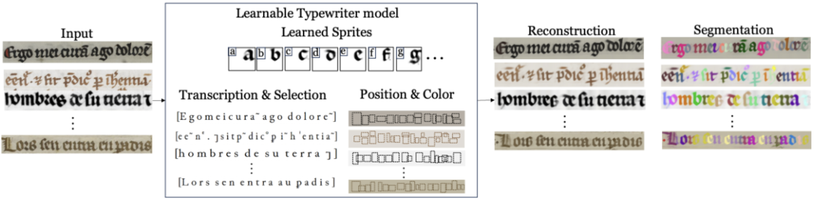

# The Learnable Scriber <br><sub>An adaptation of the [Learnable Typewriter](https://github.com/ysig/learnable-typewriter) for morphological script type analysis</sub>
Github repository of the [An Interpretable Deep Learning Approach for Morphological Script Type Analysis] (add paper on arXiv or webpage).  
Authors: Malamatenia Vlachou, [Yannis Siglidis](https://imagine.enpc.fr/~siglidii/), [Dominique Stutzmann](https://cv.hal.science/dominique-stutzmann), [Mathieu Aubry](http://imagine.enpc.fr/~aubrym/).  
Research Institute: [IRHT](), (https://www.irht.cnrs.fr/), _Institut de Recherche et d'Histoire des Textes, CNRS_, [Imagine](https://imagine.enpc.fr/), _LIGM, Ecole des Ponts, Univ Gustave Eiffel, CNRS, Marne-la-Vallée, France_

## Install :seedling:
```shell
conda create --name ltw pytorch==1.9.1 torchvision==0.10.1 cudatoolkit=11.3 -c pytorch -c conda-forge
conda activate ltw
python -m pip install -r requirements.txt
```

### Datasets :sunny: Models :hammer: (MV: adjust this to my data)
Download & extract [datasets.zip](https://www.dropbox.com/s/0fa9hcbfu9vr3t2/datasets.zip?dl=0) and [runs.zip](https://www.dropbox.com/s/c4c7lbp1ydqs9dj/runs.zip?dl=0) in the parent folder.

## Inference :peach:
For minimal inference and plotting we provide a [standalone notebook. ](https://colab.research.google.com/drive/11_CGvoXvpulKNEDsRN9MdBS35NvNz5l7?usp=sharing) (MV: in construction)

Helper scripts are also provided to perform evaluation on the corresponding datasets:

```python
python scripts/eval.py -i <MODEL-PATH> {--eval, --eval_best}
```

and produce figures and sprites for certain samples:

```python
python scripts/eval.py -i <MODEL-PATH> -s {train, val, test} -id 0 0 0 -is 1 2 3 --plot_sprites
```

## Training :blossom:
Training and model configure is performed though hydra.
We supply the corresponding config files for all our baseline experiments.


### Southern and Northern _Textualis_ 📜:
```python
python scripts/train.py iwcp_south_north.yaml
```

and finetune script types with:

```python
python scripts/finetune_script.py -i fontenay/fontenay/<MODEL_NAME> -o fontenay/fontenay-ft/ --max_epochs 150 -k "training.optimizer.lr=0.001"

python scripts/finetune_scripts.py -i runs/iwcp_south_north/iwcp-south-north-0.01-4/2024-02-26_11-32-17/ -o finetune_runs/iwcp_south-north_scripts --max_steps 2500 --script Northern_Textualis Southern_Textualis --mode g_theta --invert_sprites --annotation_file 'datasets/iwcp_south_north/annotation.json' -d datasets/iwcp/ --split train
```

and documents with: 

```python
python scripts/finetune_docs.py -i runs/iwcp_south_north/iwcp-south-north-0.01-4/2024-02-26_11-32-17/ -o finetune_runs/iwcp_south_north_individual/ --mode g_theta --invert_sprites -a datasets/iwcp_south_north/annotation.json -d datasets/iwcp_south_north/ --max_steps 2500 --split all
```

> To all of the above experiment config files, additional command line overrides could be applied to further modify them using the [hydra syntax](https://hydra.cc/docs/advanced/override_grammar/basic/).

### Custom Dataset :floppy_disk:
Trying the LT on a new dataset is dead easy.

First create a config file:

```
configs/<DATASET_ID>.yaml
...

DATASET-TAG:
  path: <DATASET-NAME>/
  sep: ''                    # How the character separator is denoted in the annotation. 
  space: ' '                 # How the space is denoted in the annotation.
```

Then create the dataset folder:

```
datasets/<DATASET-NAME>
├── annotation.json
└── images
  ├── <image_id>.jpg or .png 
  └── ...
```


The annotation.json file should be a dictionary with entries of the form:
```
    "<image_id>": {
        "split": "train",                            # {"train", "val", "test"} - "val" is ignored in the unsupervised case.
        "label": "A beautiful calico cat."           # The text that corresponds to this line.
        "script": " Southern_Textualis"             # Corresponds to the script type of the image
    },
```

You can completely ignore the annotation.json file in the case of unsupervised training without evaluation.

### Logging :chart_with_downwards_trend: MV: adjust this also for wandb 
Logging is done through tensorboard. To visualize results run:

```bash
tensorboard --logdir ./<run_dir>/
```

### Citing :dizzy: MV: add this part 

```bibtex
@misc{the-learnable-scriber,
	title = {The Learnable Typewriter: A Generative Approach to Text Line Analysis},
	author = {Vlachou-Efstathiou, Malamatenia and Siglidis, Ioannis and Stutzmann, Dominique, and Aubry, Mathieu},
	publisher = {arXiv},
	year = {2024},
	url = {},
	keywords = {Computer Vision and Pattern Recognition (cs.CV), Digital Palaeography, Document Analysis},
	doi = {},
	copyright = {Creative Commons Attribution 4.0 International}
}
```

## Acknowledgements :sparkles:
This study was supported by the CNRS through MITI and the 80|Prime program (CrEMe Caractérisation des écritures médiévales) , and by the European Research Council (ERC project DISCOVER, number 101076028). We thank Ségolène Albouy, Raphaël Baena, Sonat Baltacı, Syrine Kalleli, and Elliot Vincent for valuable feedback on the paper.
