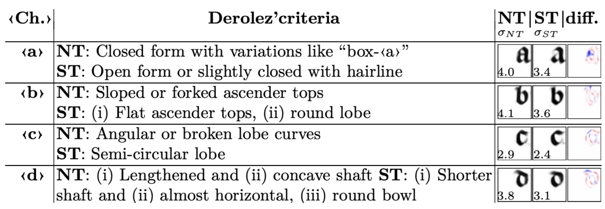

# <p align="center">An Interpretable Deep Learning Approach for Morphological Script Type Analysis (IWCP 2024) [](https://doi.org/10.5281/zenodo.15297804) </p> <p align="center"> https://learnable-handwriter.github.io/ </p> <sub> [Malamatenia Vlachou Efstathiou](https://malamatenia.github.io/), [Ioannis Siglidis](https://imagine.enpc.fr/~siglidii/), [Dominique Stutzmann](https://www.irht.cnrs.fr/fr/annuaire/stutzmann-dominique) and [Mathieu Aubry](https://imagine.enpc.fr/~aubrym/) </sub> </p>



- For training without having to install, we provide a standalone Colab[](https://colab.research.google.com/drive/12CGIAhzeBJWgm9o9Tb8dCHFDxzcxwWzF?usp=sharing) notebook.


- For minimal inference on pre-trained and finetuned models without having to install, we provide a standalone Colab[](https://colab.research.google.com/drive/11_CGvoXvpulKNEDsRN9MdBS35NvNz5l7?usp=sharing) notebook.

- A [figures.ipynb]([https://github.com/malamatenia/learnable-scriber/blob/a3afc60a3b8d9dcd7dca99b0e8c547301124bfd5/figures.ipynb](https://github.com/malamatenia/learnable-handwriter/blob/cf5cf0927abc423c3706a637aff59174248feb72/scripts/reproduce_results/figures.ipynb)) notebook is provided to reproduce the paper results and graphs. You'll need to download & extract [datasets.zip](https://www.dropbox.com/scl/fi/tfz79kwxoe4vp5e4npmxa/datasets.zip?rlkey=2820mu0bddpnax6alx04bglzu&st=caxfyfsp&dl=0) and [runs.zip](https://www.dropbox.com/scl/fi/4zc24m63hxhkh04y5xdi8/runs.zip?rlkey=6fr598xdiyh8a2yiiydxr7hw5&st=1svl5gpn&dl=0) in the base folder first or run it directly in Colab[](https://colab.research.google.com/github/malamatenia/learnable-handwriter/blob/cf5cf0927abc423c3706a637aff59174248feb72/scripts/reproduce_results/figures.ipynb)
- 
## Getting Started
### Install

> [!NOTE]
> macOS is not supported due to compatibility issues with the available PyTorch version (affine transforms are not fully implemented or optimized in the macOS build). We recommend running the code on a Linux system (locally or on a server) with CUDA support. For training, the use of a GPU is strongly advised. 

After cloning the repository and entering the base folder:
  
1. Create a conda environment:
   ```shell
   conda create --name lhr python=3.10
   conda activate lhr
   ```
2. [Install pytorch.](https://pytorch.org/get-started/locally/)
3. If you're using pip:
    ```shell
    python -m pip install -r requirements.txt
    ```

## Run it from scratch on our dataset
 ### Train

   In this case you'll need to download & extract only the [datasets.zip](https://www.dropbox.com/scl/fi/tfz79kwxoe4vp5e4npmxa/datasets.zip?rlkey=2820mu0bddpnax6alx04bglzu&st=caxfyfsp&dl=0).

   ### Train our reference model with:
   ```python

   python scripts/train.py iwcp_south_north.yaml 
   ```
 ### Finetune

   ### 1. Northern and Southern _Textualis_ models with: 
   ```python

   python scripts/finetune_scripts.py -i runs/iwcp_south_north/train/ -o runs/iwcp_south_north/finetune/ --mode g_theta --max_steps 2500 --invert_sprites --script Northern_Textualis Southern_Textualis -a datasets/iwcp_south_north/annotation.json -d datasets/iwcp_south_north/ --split train
   ```

   ### 2. document models with: 
   ```python

   python scripts/finetune_docs.py -i runs/iwcp_south_north/train/ -o runs/iwcp_south_north/finetune/ --mode g_theta --max_steps 2500 --invert_sprites -a datasets/iwcp_south_north/annotation.json -d datasets/iwcp_south_north/ --split all
   ```


## Run it on your data
### Create your config files:

### 1. Create a config file for the dataset:
```
configs/dataset/<DATASET_ID>.yaml
...

DATASET-TAG:                 
  path: <DATASET-NAME>/      
  sep: ''                    # How the character separator is denoted in the annotation. 
  space: ' '                 # How the space is denoted in the annotation.
```

### 2. then a second one setting the hyperparameters: 
```
configs/<DATASET_ID>.yaml
...
```

For its structure, see the config file provided for our experiment.

### Create your dataset folder:

 
 ### 3. Create the dataset folder:
```
datasets/<DATASET-NAME>
├── annotation.json
└── images
  ├── <image_id>.png 
  └── ...
```

The annotation.json file should be a dictionary with entries of the form:
```
    "<image_id>": {
        "split": "train",                            # {"train", "val", "test"} - "val" is ignored in the unsupervised case.
        "label": "A beautiful calico cat."           # The text that corresponds to this line.
        "script": "Times_New_Roman"                  # (optional) Corresponds to the script type of the image
    },
```

You can completely ignore the annotation.json file in the case of unsupervised training without evaluation.


### Train and finetune

 
### 4. Train with
```python

   python scripts/train.py <CONFIG_NAME>.yaml
```

### 5. Finetune

 - On a group of documents defined by their "script" type with:
```python

python scripts/finetune_scripts.py -i runs/<MODEL_PATH> -o <OUTPUT_PATH> --mode g_theta --max_steps <int> --invert_sprites --script '<SCRIPT_NAME>' -a <DATASET_PATH>/annotation.json -d <DATASET_PATH> --split <train or all>
```

- On individual documents with:

```python

python scripts/finetune_docs.py -i runs/<MODEL_PATH> -o <OUTPUT_PATH> --mode g_theta --max_steps <int> --invert_sprites -a <DATASET_PATH>/annotation.json -d <DATASET_PATH> --split <train or all>
```
 
> [!NOTE]
> To ensure a consistent set of characters regardless of the annotation source for our analysis, we implement internally [choco-mufin](https://github.com/PonteIneptique/choco-mufin), using a disambiguation-table.csv to normalize or exclude characters from the annotations. The current configuration suppresses allographs and edition signs (e.g., modern punctuation) for a graphetic result.

## Cite us

```bibtex
@misc{vlachou2024interpretable,
    title = {An Interpretable Deep Learning Approach for Morphological Script Type Analysis},
    author = {Vlachou-Efstathiou, Malamatenia and Siglidis, Ioannis and Stutzmann, Dominique and Aubry, Mathieu},
    publisher = {Document Analysis and Recognition--ICDAR 2021 Workshops: Athens, Greece, August 30--September 4, 2023, Proceedings},
    year = {2024},
    organization={Springer}, 
    url={https://arxiv.org/abs/2408.11150}}
```

Check out also: [Siglidis, I., Gonthier, N., Gaubil, J., Monnier, T., & Aubry, M. (2023). The Learnable Typewriter: A Generative Approach to Text Analysis.](https://imagine.enpc.fr/~siglidii/learnable-typewriter/)


## Acknowledgements
This study was supported by the CNRS through MITI and the 80|Prime program (CrEMe Caractérisation des écritures médiévales) , and by the European Research Council (ERC project DISCOVER, number 101076028). We thank Ségolène Albouy, Raphaël Baena, Sonat Baltacı, Syrine Kalleli, and Elliot Vincent for valuable feedback on the paper.
